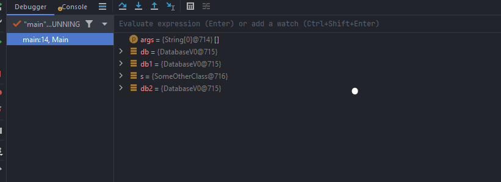

# V0 Database (lazy loading, normal function)
- Has the private constructor so that from outside classes are not created. 
- Has the static method getInstances which creates the object of the class, if not created previously.  
- Has the static variable instance which is accessed by the getInstance method.



As in this below screenshot 
all the references are pointing to the same location 715
which means only one instance of the DatabaseV0 is created

- Problem with this approach is that, if somebody invokes this is multithreaded environment 
  - multiple instance of DatabaseV0 will be created 
- Solution 
  - would be to add <u>Synchronized</u> or <u> Eager Loading </u> key word for the method

# V1 Database  (Eager loading)
```java
public class DatabaseV0 {
    private static final DatabaseV0 instance = new DatabaseV0();
    private DatabaseV0() {}

    public synchronized static DatabaseV0 getInstance() {
        return instance;
    }
}
```
- Problem with V1
  -  Performance issue as the object is created on the start of the application, which slows down startup of the app. 
  - we cannot pass variable to constructor, 
    - if in case we need to pass username, password or url to constructor


# V2 Database (Synchronized keyword)
```java
public class DatabaseV0 {
    private static DatabaseV0 instance = null;
    private DatabaseV0() {}

    public synchronized static DatabaseV0 getInstance() {
        if (instance == null) {
            instance = new DatabaseV0();
        }
        return instance;
    }
}
```

- Problem with V2 Database
  - getInstance method holds the threads and try to complete the task one by one, causing <u>performance issues</u>.


# V3 Database (Double Check locking )
```java
public class DatabaseV0 {
    private static DatabaseV0 instance = null;
    private DatabaseV0() {}

    public static DatabaseV0 getInstance() {
        if (instance == null) {
            Synchronized {
                if (instance == null) {
                    instance = new DatabaseV0();                    
                }
            }
        }
        return instance;
    }
}
```
 
- Here we check without lock, which increases performance 
- after the first if statement 
  - if 2 threads are simultaneously allowed inside, as there is no lock for the first if statement 2 instances are created. 
  - hence to solve this again we have to double check with instance if it is still null.

Problem V3
- With Serialization and Reflection in java this can break and create multiple instances 
- Best way to create single to in java is using <u>ENUMS</u>


### Cons of single ton 
- Unit testing <u>mocking objects</u> is difficult.
- You cannot create <u>sub classes</u> in single ton

### where are single tons used 
- In spring boot by default all the components 
  - controller 
  - service
  - repository 
  - are singleton in nature


### when to use single ton
- Shared resources 
  - config files: securityconfig
- expensive creation 
  - database connections 
- Stateless 
  - no attributes in the class (like mock services)
- Only object to be persent accross the application 
  - config file or mock database
